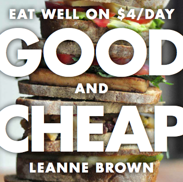
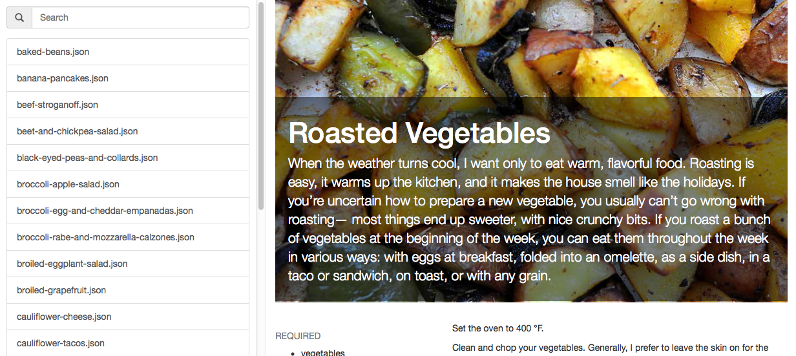

# *Good and Cheap* by Leanne Brown in `JSON`

This repository contains machine readable versions of [Good and Cheap: Eat Well on $4/Day](http://www.leannebrown.com/buy/good-and-cheap) by [Leanne Brown](http://www.leannebrown.com). This project is possible because she released the book under a **Creative Commons Attribution-NonCommercialShareAlike** license. Please support openly licensed works and [check out her site](http://www.leannebrown.com), or consider [buying a print copy](http://www.leannebrown.com/buy/good-and-cheap)!

**This data is a work in progress, not all recipes have been added yet, and since they were converted by hand from the PDF, there may be some typos, inaccuracies, format inconsistencies, etc.** 

Issues and pull requests are welcome!

## Formats

- **Data**
	- YAML
	- JSON
- **Images**
	- Full Size

## Demo
I've included a [Javascript reference client](http://alexking.github.io/good-and-cheap/) to help in checking the data, and developing the format. You can view it on [github pages](http://alexking.github.io/good-and-cheap/), or start it locally using `rake serve`.

This is also a work in progress, and doesn't understand how `ways` elements work yet. 

### Data
Data is available in YAML or JSON, and recipes use the following format specification. 

#### `title`
Title of the recipe.

#### `description`
Information about the recipe that would not be considered instructions.

#### `ingredients`
Lists ingredients for the recipe. May be an array, or a hash listing different ingredient groups.

	ingredients:
		required: 
			- ketchup

		optional: 
			- mustard

		additions: 
			- relish

#### `instructions`
Instructions on how to make the recipe.

#### `category`
Allows you to specify a category for the recipe.

#### `page`
If the source of the recipe is a book, this allows you to specify the page. 

#### `estimate`
An estimate for the cost to make the recipe. Does not include `$`, has two decimal places, and the three letter currency abbreviation. 

	estimate: 2.50 USD

#### `serves`
The number of people you can expect to serve with this recipe. This may be a range by using a dash.

	serves: 2-4

#### `makes`
The number of items that this recipe makes. This may be a range by using a dash. May include a unit (such as `cups`), but if it makes a number of items, the item should not be used as a unit (for a taco recipe, it makes `4-8` instead of `4-8 tacos`)

	makes: 4-8 cups

#### `ways` (optional)
Allows variations to the ingredients, instructions, or any other property to be listed. 

	ways:
		with pepper:
			estimate: 1.00
		
			ingredients:
				required:
					- pepper

			instructions: At the end, add the pepper.

For fields that contain lists (such as `ingredients` and `instructions`), the base list will be added to. Fields that contain values (such as `estimate` or `page`) replace the base value.

## Contribute
All data entry takes place in the `/recipes/source` folder as `YAML`. The rest of the formats are generated using `rake`, so in order to change them, you need to edit the data in the source `YAML`, then run `rake` to regenerate. 

## License
**Good and Cheap: Eat Well on $4/Day** by [Leanne Brown](http://www.leannebrown.com)

Source file is [available here](http://www.leannebrown.com/good-and-cheap.pdf) [PDF].

**Source License** (from cover page)

> Text, recipes, and most photographs and design by Leanne Brown, in fulfillment of a final project for a master’s degree in Food Studies at New York University.

> This book is distributed under a [Creative Commons Attribution-NonCommercialShareAlike 4.0](http://www.creativecommons.org/licenses/by-nc-sa/4.0) license. For more information, visit [www.creativecommons.org/licenses/by-nc-sa/4.0](http://www.creativecommons.org/licenses/by-nc-sa/4.0)

> You may freely distribute this book electronically. To download a free PDF or buy a print copy, visit [www.leannebrown.com](http://www.leannebrown.com)

The original material has been modified to a machine readable format, along with other changes. The results are share-alike'd under [Creative Commons Attribution NonCommercial-ShareAlike 4.0](http://www.creativecommons.org/licenses/by-nc-sa/4.0).

The **code** (i.e. not recipes, recipe images) in this repository that is used to process recipes, etc., is released into the public domain via the [unlicense](http://unlicense.org). 

